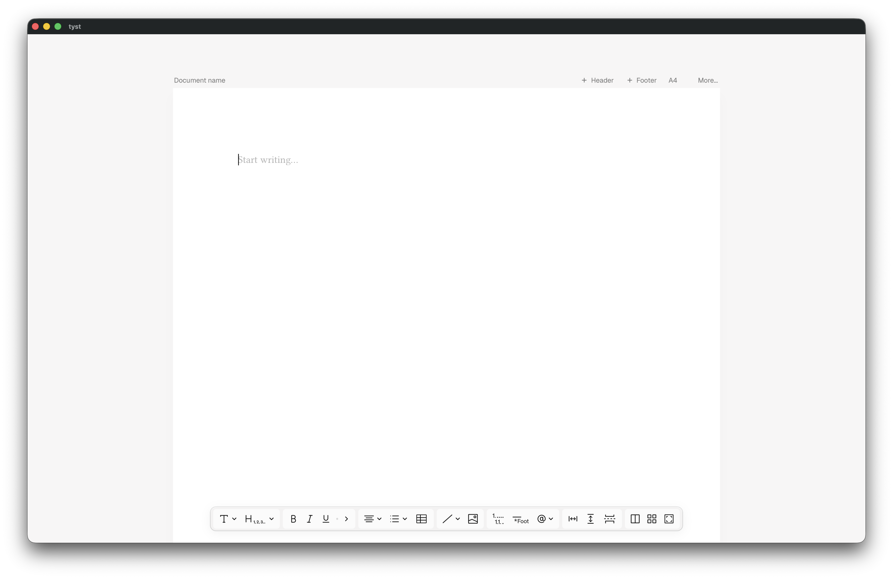

  

**tyst** is a minimal document editor with the ideas of [Typst](https://typst.app) in an interface. It export serializes to .typ source files and exports to PDF.

It gives you a clean, distraction-free writing surface with a floating toolbar for formatting — text styles, headings, lists, tables, images, footnotes, and more. Document settings like page size, margins, fonts, and language live in a top bar out of the way.

Built with [Tauri](https://tauri.app) and [Svelte](https://svelte.dev). Requires the [Typst CLI](https://github.com/typst/typst) for PDF export.
